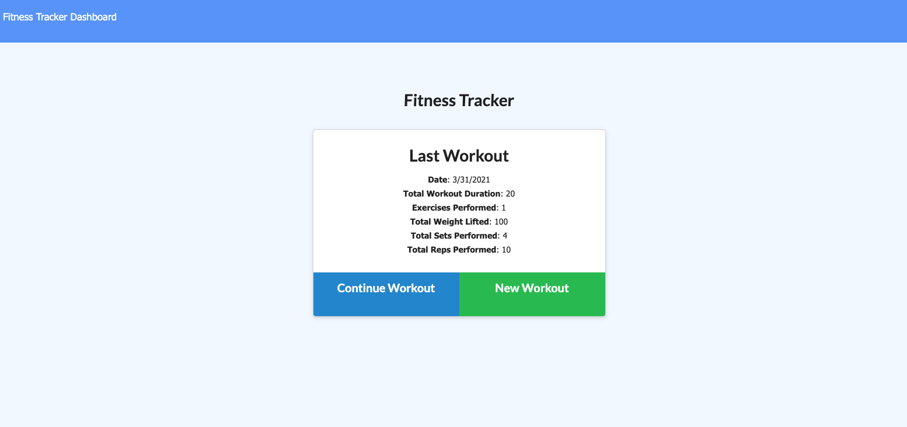
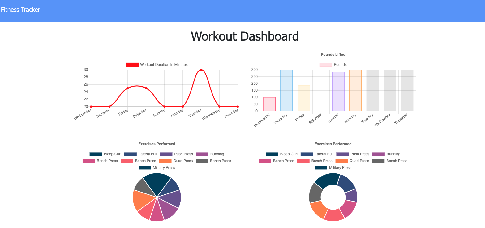

# fitness-tracker-mongo

Fitness Tracker - Mongo

## Description

This is a fitness tracker app deployed on Heroku. The database uses Mongo DB and Mongoose. The application runs as expected locally but currently the deployed app will not show the dashboard.

## Table of Contents

- [Installation](#installation)
- [Usage](#usage)
- [Contributing](#contributing)
- [Tests](#tests)
- [Questions](#questions)
- [License](#license)

## Installation

The application will run by starting the server using node server or nodemon server. The application will work from the deployed site bt clicking to add exercises and new workouts. The application is deployed on [Heroku] (https://evening-chamber-45147.herokuapp.com/). [GitHub] (https://github.com/jasdjames/fitness-tracker-mongo).

The pictures below are from the local hosting of the page

## Usage

The user may use this application to track workouts

## Contributing

Anyone my contact me for contributions to the application. I completed this application with the help of my instructor, tutor, classwork, and collaboratively with classmates.

## Tests

No tests

## Questions

For more information contact me via email or GitHub
[jasdjames]
(https://github.com/jasdjames)
jasdjames@gmail.com

## License

MIT
MIT License

    Copyright (c) [year] [JasDJames]

    Permission is hereby granted, free of charge, to any person obtaining a copy
    of this software and associated documentation files (the "Software"), to deal
    in the Software without restriction, including without limitation the rights
    to use, copy, modify, merge, publish, distribute, sublicense, and/or sell
    copies of the Software, and to permit persons to whom the Software is
    furnished to do so, subject to the following conditions:

    The above copyright notice and this permission notice shall be included in all
    copies or substantial portions of the Software.

    THE SOFTWARE IS PROVIDED "AS IS", WITHOUT WARRANTY OF ANY KIND, EXPRESS OR
    IMPLIED, INCLUDING BUT NOT LIMITED TO THE WARRANTIES OF MERCHANTABILITY,
    FITNESS FOR A PARTICULAR PURPOSE AND NONINFRINGEMENT. IN NO EVENT SHALL THE
    AUTHORS OR COPYRIGHT HOLDERS BE LIABLE FOR ANY CLAIM, DAMAGES OR OTHER
    LIABILITY, WHETHER IN AN ACTION OF CONTRACT, TORT OR OTHERWISE, ARISING FROM,
    OUT OF OR IN CONNECTION WITH THE SOFTWARE OR THE USE OR OTHER DEALINGS IN THE
    SOFTWARE.
